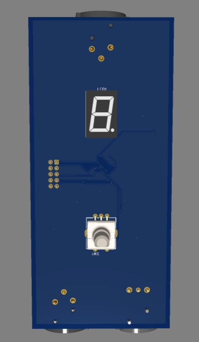
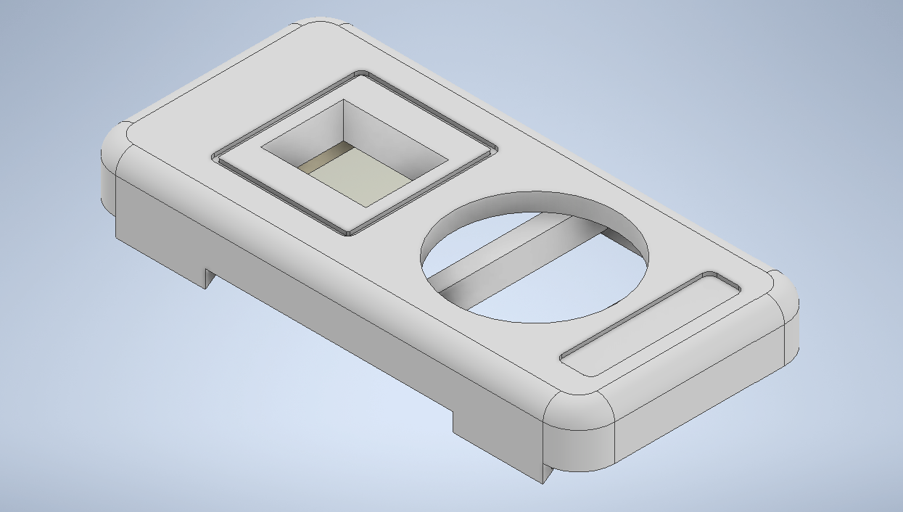

# AVR-PWM-dimmer
PWM dimmer for low voltage load control based on Atmega microcontroller

This dimmer is designed for managing low-voltage loads such as LED lamps, 
LED strips, and similar devices. It supports an input voltage range of 6–24V 
and features built-in voltage stabilization to ensure reliable 
operation of the internal microcontroller. 

The maximum load current is 4A, making it suitable for 
a variety of low-voltage lighting applications.

The dimmer provides the ability to adjust brightness across 10 discrete levels, 
allowing for precise control to suit various lighting preferences and environments.

The device also supports on/off control via a pressable rotary encoder, 
offering intuitive operation alongside brightness adjustment. 
This enhances user interaction by combining tactile feedback with versatile functionality.

The construction features a two-layer PCB for reliable performance and compact design. 
Additionally, a 3D-printable case is included, 
allowing the device to be securely placed on a tabletop—combining functionality with convenience.

Tools Used in This Project:
- 🧩 EasyEDA — for designing the schematic and PCB layout
- 🛠️ Autodesk Inventor — used to model the custom case
- 🖨️ Cura — slicing software for preparing the 3D printable case
- 💻 Microchip Studio — for writing and uploading the device firmwar

Take a look below to explore the illustrations showcasing the device’s features and setup.

